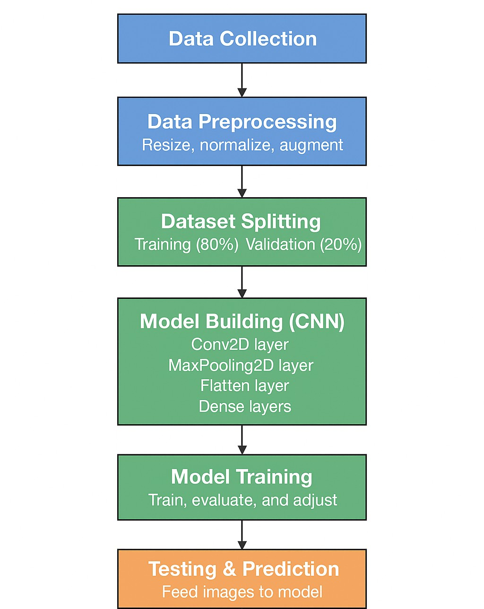

# Automated Fruit Freshness Detection using Computer Vision

An AI-based quality inspection system developed using Convolutional Neural Networks (CNN) to classify fruits as fresh or spoiled using Computer Vision techniques.

---

## Project Overview

This project focuses on automating fruit freshness detection using Deep Learning and image classification. The system is trained on fruit image datasets and predicts whether a fruit is fresh or spoiled.

The project simulates quality-check workflows commonly used in food processing and retail environments.

---

## Features

- Fruit freshness classification using CNN
- Image preprocessing and normalization
- Data augmentation for improved model performance
- Prediction visualization on unseen images
- Model evaluation using validation accuracy

---

## Dataset

- Dataset contains 2,300+ fruit images
- Categories include:
  - Fresh Apples
  - Spoiled Apples
  - Fresh Bananas
  - Spoiled Bananas
  - Fresh Oranges
  - Spoiled Oranges
  - Fresh Grapes
  - Spoiled Grapes
  - Fresh Mangoes
  - Spoiled Mangoes

---

## Technologies Used

- Python
- TensorFlow
- Keras
- NumPy
- Pandas
- Google Colab

---

## Model Performance

- Training Accuracy: 90%
- Validation Accuracy: 88.5%

---

## Project Workflow

1. Dataset Collection
2. Image Preprocessing
3. Data Augmentation
4. CNN Model Training
5. Model Evaluation
6. Prediction & Visualization

### Workflow Diagram



---

## Repository Structure

```bash
dataset/
model/
notebooks/
outputs/
